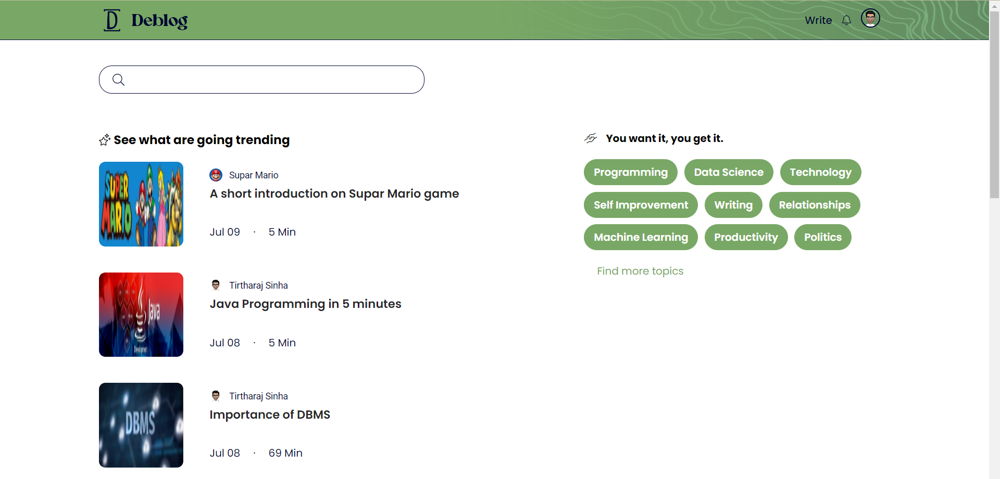

#  Deblog

### A Modern yet simple blog engine built on ASP.NET Core

| Technology        | Used                             |
| ----------------- | -------------------------------- |
| Templating Engine | Microsoft's Razor parsing engine |
| ORM               | Entity Framework                 |
| Database          | mysql(XAMPP) through Pomelo      |
| Authentication    | Identity                         |

### Schema : [database-schema.txt](ProjectStructure/database-schema.txt)

### Route workflow : [controller.txt](ProjectStructure/controller.txt)

# ScreenShots

### Landing page

### Login page

### Home page

### New Blog page

### Update Blog Metadata page

### Write Blog page

### Blog viewer

### Your blogs management page

### User Settings page

